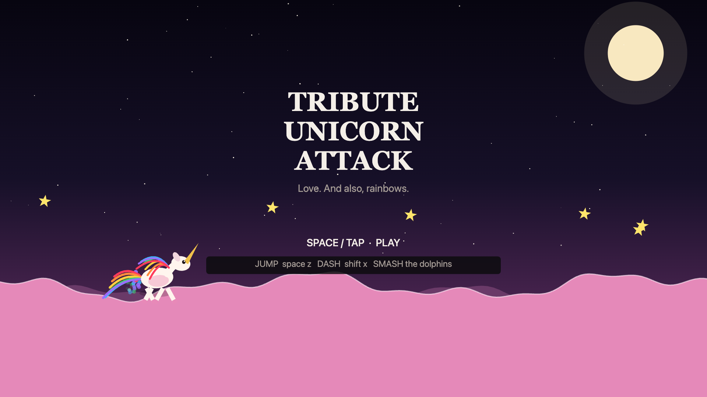
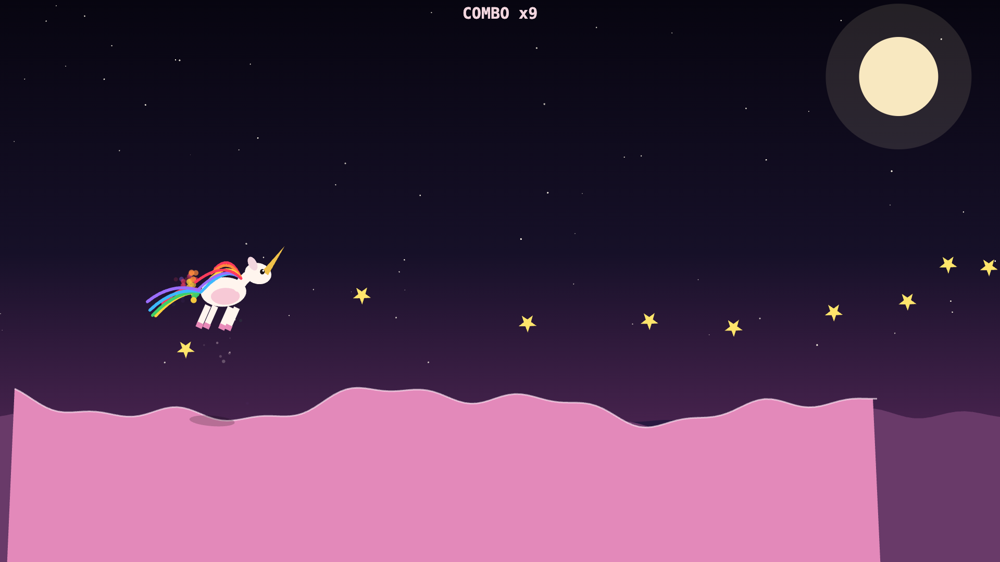
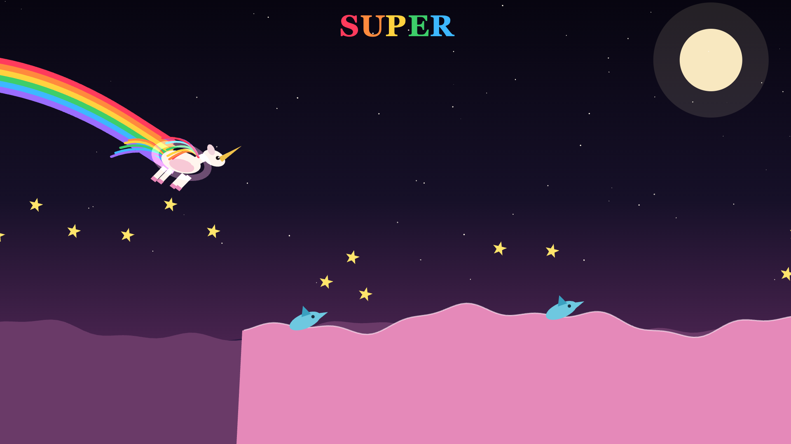

# Tribute Unicorn Attack

A js13k 2026 entry. Endless runner, one canvas, no dependencies.

Jump, double-jump, dash through dolphins, chase a combo. Love. And also, rainbows.



| | |
|---|---|
|  |  |

## Play

```bash
npm run serve
# open http://127.0.0.1:8123/index.html
```

| | |
|---|---|
| Jump | `Space` / `Z` / `W` / `↑` — hold for extra height |
| Dash | `Shift` / `X` / `K` |
| Mute | `M` |
| Back to title | `Esc` (from the game-over screen) |

Touch works too: tap the left half to jump, the right half to dash.

Combo ×100 triggers SUPER, which turns the run into a hovering rainbow for ten seconds.

## Build

```bash
npm install
npm run build
```

Minifies `src.js` with terser, inlines it into a single HTML file, and zips it:

```
dist/index.html   the whole game in one file
dist/rua.zip      the competition submission
```

The build prints the zip size against the js13k limit and fails if it goes over.

**Current size: 7654 / 13312 bytes (57.5%).**

## How it is built

`src.js` is the entire game — about 1000 lines of plain ES2020, no imports, no framework, no build step needed to run it. `index.html` just loads it.

Everything is generated at runtime rather than shipped as assets:

- **Art** is drawn with canvas paths. The unicorn, the dolphins, the parallax hills and the moon are all code.
- **Music and sound** are synthesised with WebAudio — two procedurally stitched loops (calm and hot) plus generated one-shots. No audio files.
- **Terrain** is three summed sine waves; gaps, stars and obstacles come from a seeded PRNG.
- **Particles** live in a preallocated ring-buffer pool, so the frame loop never grows an array.

The render loop was profiled with Chrome DevTools Protocol counters and runs about 20% less main-thread JS per frame than the first draft: the sky gradient and palette are memoised against the day clock, the 64-star field is batched into five alpha buckets instead of 64 separate fills, and the terrain is sampled coarsely enough that the extra vertices would have landed inside the stroke width anyway.

## License

MIT
